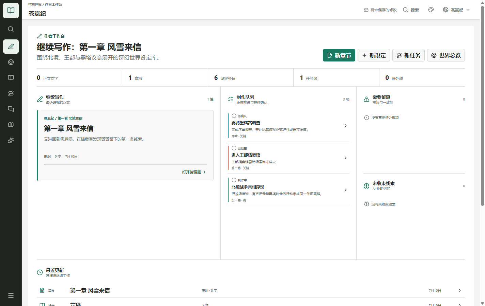
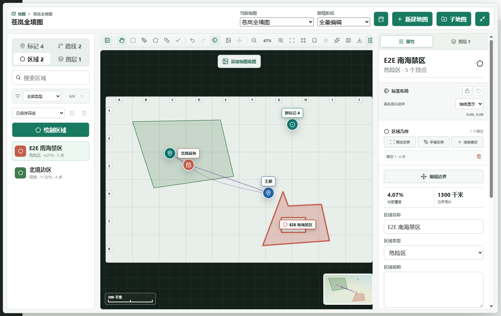
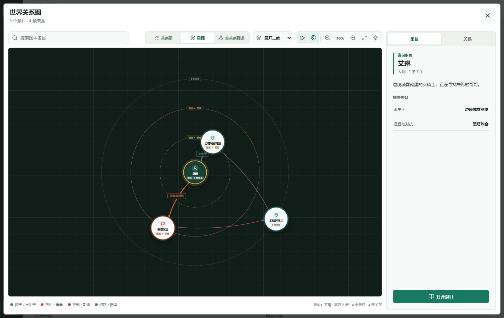

# Worldcraft Codex

Worldcraft Codex 是一款本地优先的 Windows 世界观与叙事开发软件。它把世界 Wiki、设定条目、长篇小说、任务线、分支剧情、互动地图、关系图谱、时间线、资源库和可连接第三方模型的 AI 写作工具放在同一个桌面工程里。

> 当前版本：`2.2.0-rc.22` 展演候选版。候选安装包尚未进行 Authenticode 代码签名，不应冒充正式稳定版。



## 核心工作流

- **世界 Wiki 与知识库**：按项目树编写角色、地点、组织、事件、物品和创作笔记，并在软件内生成适合阅读的 Wiki 总览。
- **小说与剧情**：按书、卷、章、场景组织长篇正文；支持全屏写作、批注修订、版本恢复、伏笔和人物知识状态。
- **任务与分支**：设计任务步骤、触发条件、依赖图、对白节点、变量效果和可遍历的剧情测试。
- **无限地图画布**：导入多张图片，像图层工具一样移动、缩放、旋转、排序和合并；绘制区域、路线、标记、网格与比例尺。
- **关系与时间**：使用关系册、星图和全关系图谱查看大型世界网络，并用多轨时间线记录神话时间、历史时间和叙事时间。
- **AI 创作工具**：连接本地或 HTTPS OpenAI-compatible 服务，执行长篇写作、定点修订、项目级结构化操作和带来源的长期记忆召回。





完整能力见 [功能目录](docs/FEATURE_CATALOG.md)。

## 本地运行

环境要求：Windows 10/11、Node.js 24、npm。

```powershell
npm ci
npm run build:web
npm run desktop
```

开发模式：

```powershell
npm run dev
npm run desktop:dev
```

## 展演模式

已经准备好本机案例数据时，先执行只读预检，再启动桌面软件：

```powershell
npm run demo:check
npm run demo:open
```

`demo:check` 只读检查 SQLite、案例规模、山海经资源文件和第三方链接边界，不会保存项目或创建备份。完整展演路线见 [2026-07-31 展演手册](docs/SHOWCASE_DEMO_2026-07-31.md)。

## 质量与打包

```powershell
npm run typecheck
npm run release:gate
npm run dist
npm run test:portable-package
```

`npm run dist` 会在 `release/` 生成 Windows x64 便携版和 NSIS 安装版。发布门禁覆盖 SQLite、迁移、异常重启、项目包、性能、Wiki、地图、文稿、AI、安全配置、生产构建和桌面端到端流程。

## 数据边界

- 项目正文、资源、备份和 AI 凭据默认留在本机。
- 主数据库通常位于 `%APPDATA%\worldcraft-codex\worldcraft-codex.sqlite`。
- API Key 使用 Windows 系统加密并与工程数据分离。
- AI 默认关闭，只有作者主动配置并调用模型时才会发送所选上下文。
- Git 仓库不包含用户数据库、备份、日志、缓存、诊断包或本机绝对路径产物。
- 当前范围明确不包含公开社区、实时多人协作和插件市场。

更多说明：

- [隐私与本地数据](docs/PRIVACY_AND_LOCAL_DATA.md)
- [备份与恢复](docs/BACKUP_AND_RECOVERY.md)
- [已知限制](docs/KNOWN_LIMITATIONS.md)
- [安全策略](SECURITY.md)
- [候选版发行说明](docs/RELEASE_NOTES_2.2.0-rc.22.md)

## 案例内容

仓库包含《山海经》案例的构建脚本、开放古籍原文、本项目自写今译与原创改编标记，以及配套地图和独立视觉资源。`中国上古神话史` 案例按上古神话、道教、汉传佛教、藏传与南传材料、儒家礼制和民间信仰分层整理。

原典转录、项目今译、原创改编和视觉资源的权利边界见 [案例语料与许可边界](data/README.md)。

本机用户数据库不会提交到 Git。新安装默认从轻量起步包开始，完整案例需要通过仓库脚本构建或导入 `.wcodex` 工程包。

## 许可

项目当前为 `UNLICENSED`，源代码与原创视觉内容保留全部权利。依赖组件许可见构建生成的 `THIRD_PARTY_NOTICES.txt`。
